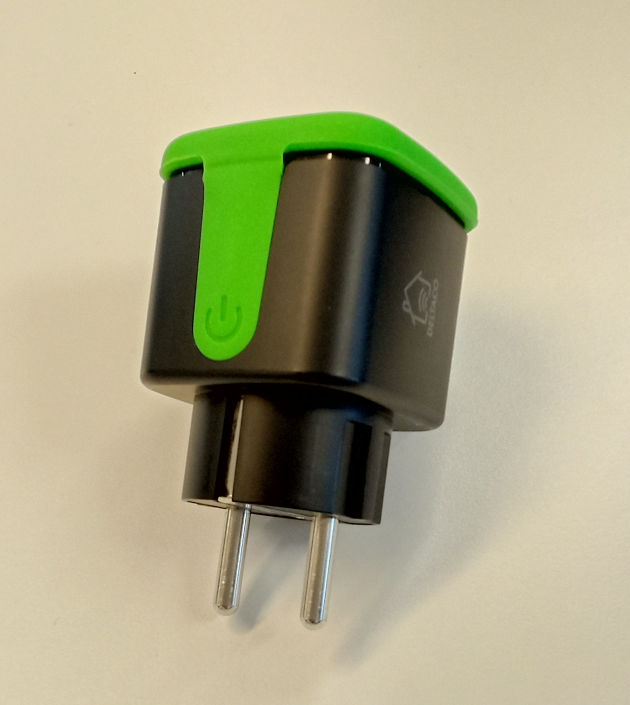

# Security Statement: Deltaco Smart Outdoor Plug
| ⚠  Note | This is an unofficial security statement not endorsed by the manufacturer. |
|---------|--------------------------------|

Security statement for the Deltaco Smart Outdoor Plug.

## Security Statements
Security statements are descriptions of the security posture of IoT devices or products. For more information on security statements and relevant tools, see the [Toolsaf](https://github.com/testofthings/toolsaf) framework.

Once you have set up Toolsaf, you can run the statement with:
```shell
python smart-outdoor-plug/statement.py
```

## Device Description
The Deltaco Smart Outdoor Plug is an electrical plug that can be controlled with a mobile application.

</br>
Fig. The device

The device's companion mobile application can be found [here](https://play.google.com/store/apps/details?id=com.deltaco.smarthome).

# Toolsaf Diagram
Toolsaf creates the following visualization for the statement:

</br>

## Findings
### Ports
An nmap scan performed on the device found the following ports:
| Protocol | ID | State |
|----------|----|-------|
| TCP | 6668 | Open |
| UDP | 63144 | Open (Filtered) |

### Notable Connections
The device and/or mobile application connect to these backends:
| Note | URL / IP |
|------|----------|
| Tuya Smart Services       | `a1.tuyaeu.com`, `m1.tuyaeu.com`, `a2.tuyaeu.com`, `m2.tuyaeu.com`, `images.tuyaeu.com` |
| Tuya Smart IoT DNS        | `h3.iot-dns.com` |
| AWS                       | `euimagesd2h2yqnfpu4gl5.cdn5th.com` |
| Tencent Cloud Computing   | `162.14.14.21` |

## Known Issues
* This statement is likely incomplete.
